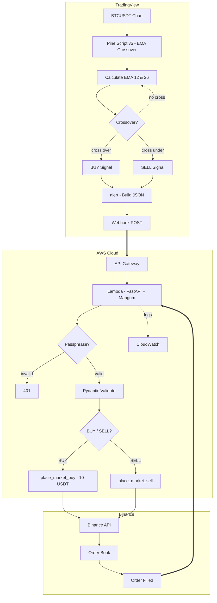
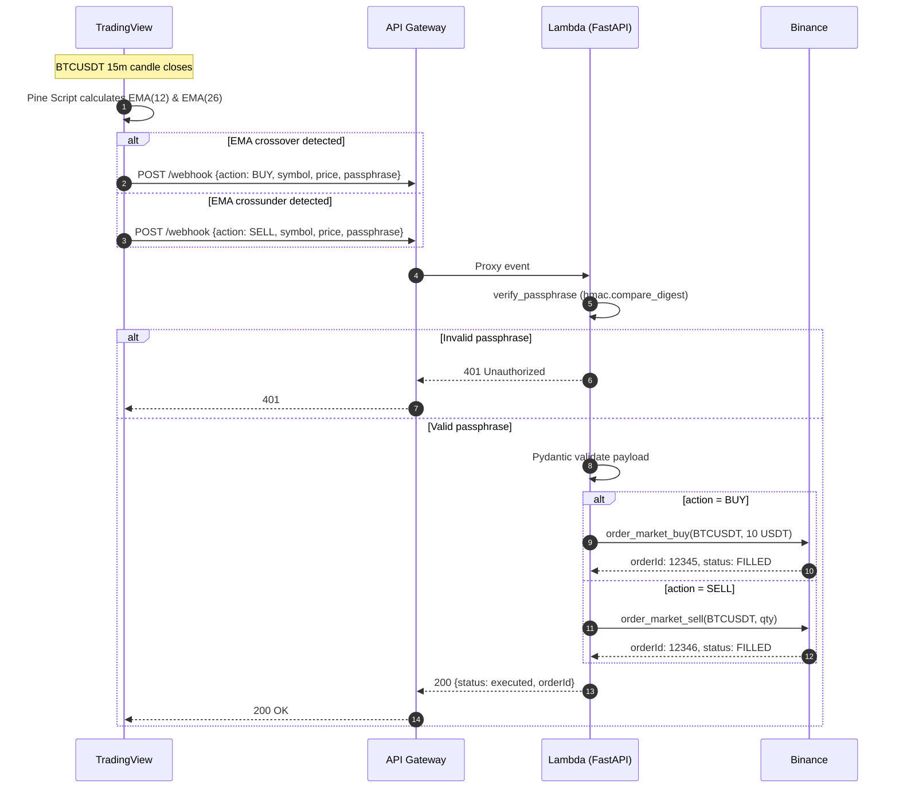
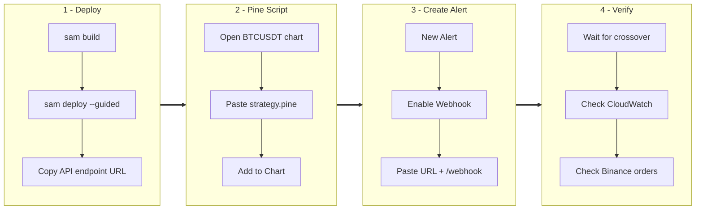

# TradingView Integration Flow

## 1. End-to-End Signal Flow

```mermaid
flowchart TB
    subgraph TV ["TradingView"]
        CHART["BTCUSDT Chart"] --> PINE["Pine Script v5 - EMA Crossover"]
        PINE --> EMA["Calculate EMA 12 & 26"]
        EMA --> CHECK{"Crossover?"}
        CHECK -- "cross over" --> BUY["BUY Signal"]
        CHECK -- "cross under" --> SELL["SELL Signal"]
        CHECK -. "no cross" .-> EMA
        BUY --> ALERT["alert - Build JSON"]
        SELL --> ALERT
        ALERT --> HOOK["Webhook POST"]
    end

    subgraph AWS ["AWS Cloud"]
        GW["API Gateway"] --> FN["Lambda - FastAPI + Mangum"]
        FN --> AUTH{"Passphrase?"}
        AUTH -- "invalid" --> DENY["401"]
        AUTH -- "valid" --> VAL["Pydantic Validate"]
        VAL --> ACT{"BUY / SELL?"}
        ACT -- "BUY" --> MBUY["place_market_buy - 10 USDT"]
        ACT -- "SELL" --> MSELL["place_market_sell"]
        FN -. "logs" .-> CW["CloudWatch"]
    end

    subgraph BIN ["Binance"]
        API["Binance API"] --> BOOK["Order Book"]
        BOOK --> OK["Order Filled"]
    end

    HOOK ==> GW
    MBUY --> API
    MSELL --> API
    OK ==> FN
```

---

## 2. Request Sequence

```mermaid
sequenceDiagram
    autonumber

    participant TV as TradingView
    participant GW as API Gateway
    participant FN as Lambda (FastAPI)
    participant BN as Binance

    Note over TV: BTCUSDT 15m candle closes

    TV->>TV: Pine Script calculates EMA(12) & EMA(26)

    alt EMA crossover detected
        TV->>GW: POST /webhook {action: BUY, symbol, price, passphrase}
    else EMA crossunder detected
        TV->>GW: POST /webhook {action: SELL, symbol, price, passphrase}
    end

    GW->>FN: Proxy event

    FN->>FN: verify_passphrase (hmac.compare_digest)

    alt Invalid passphrase
        FN-->>GW: 401 Unauthorized
        GW-->>TV: 401
    else Valid passphrase
        FN->>FN: Pydantic validate payload

        alt action = BUY
            FN->>BN: order_market_buy(BTCUSDT, 10 USDT)
            BN-->>FN: orderId: 12345, status: FILLED
        else action = SELL
            FN->>BN: order_market_sell(BTCUSDT, qty)
            BN-->>FN: orderId: 12346, status: FILLED
        end

        FN-->>GW: 200 {status: executed, orderId}
        GW-->>TV: 200 OK
    end
```

---

## 3. Setup Guide

```mermaid
flowchart LR
    subgraph S1 ["1 - Deploy"]
        A1["sam build"] --> A2["sam deploy --guided"]
        A2 --> A3["Copy API endpoint URL"]
    end

    subgraph S2 ["2 - Pine Script"]
        B1["Open BTCUSDT chart"] --> B2["Paste strategy.pine"]
        B2 --> B3["Add to Chart"]
    end

    subgraph S3 ["3 - Create Alert"]
        C1["New Alert"] --> C2["Enable Webhook"]
        C2 --> C3["Paste URL + /webhook"]
    end

    subgraph S4 ["4 - Verify"]
        D1["Wait for crossover"] --> D2["Check CloudWatch"]
        D2 --> D3["Check Binance orders"]
    end

    S1 ==> S2 ==> S3 ==> S4
```
