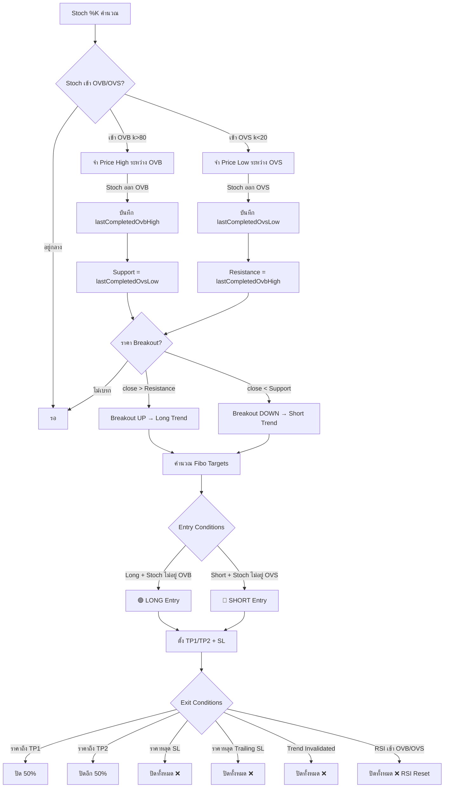
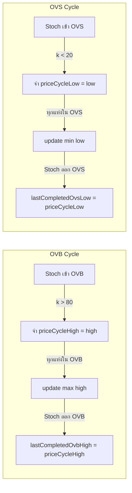
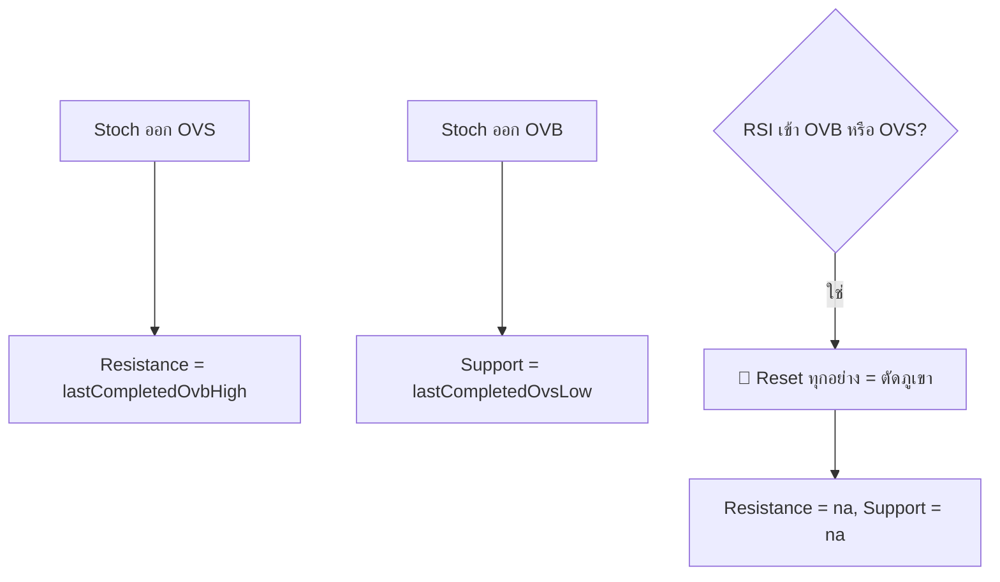
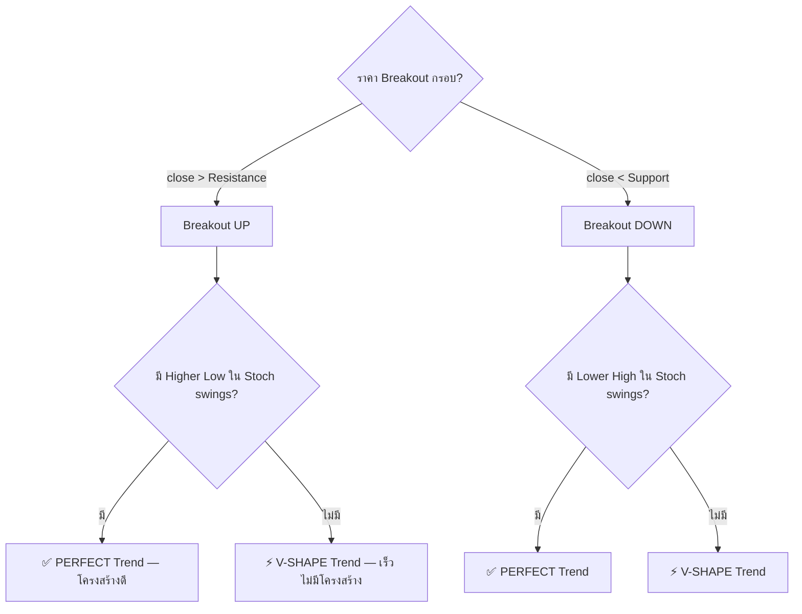
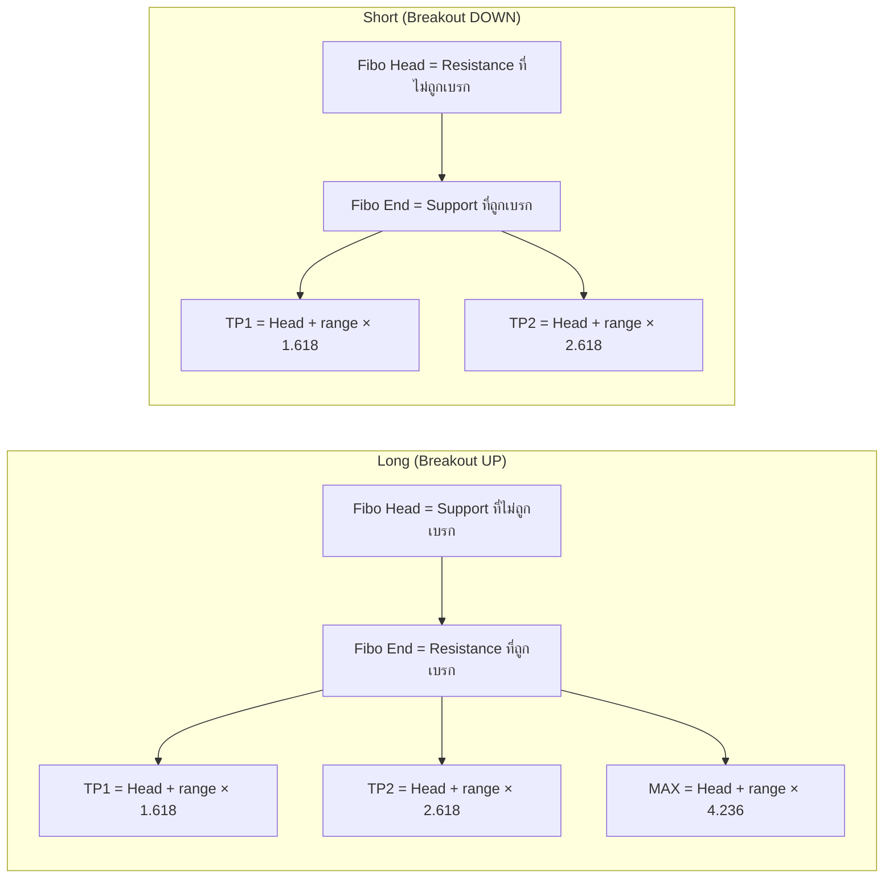
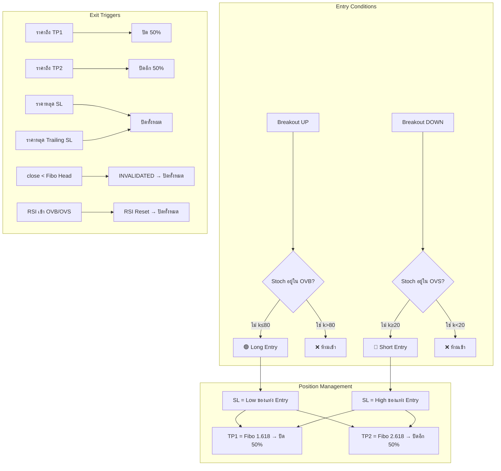
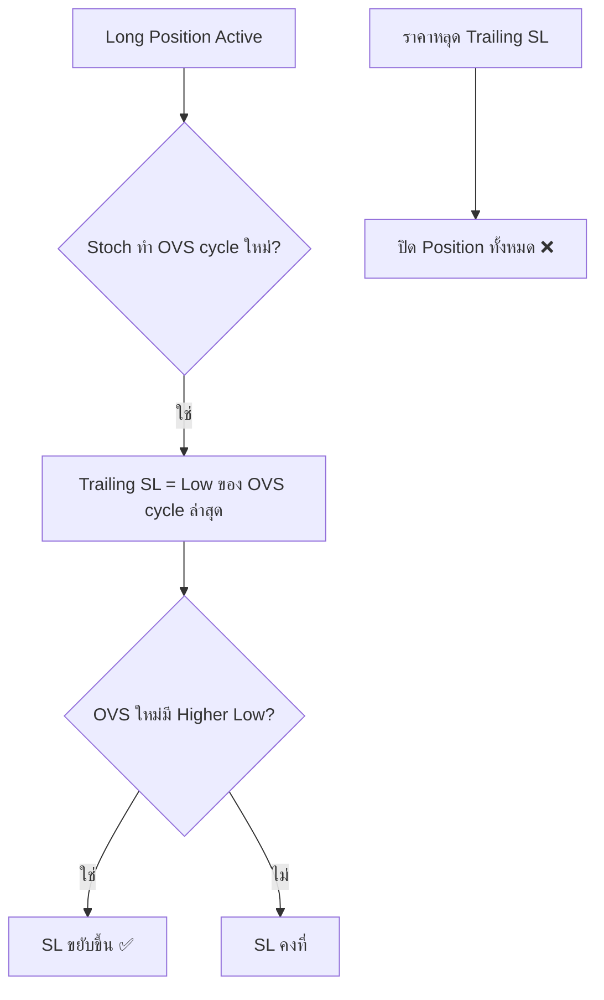
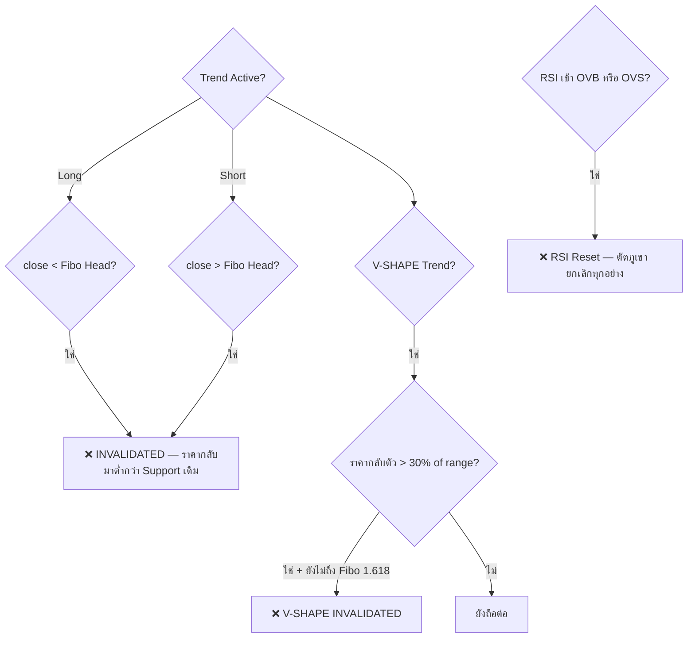
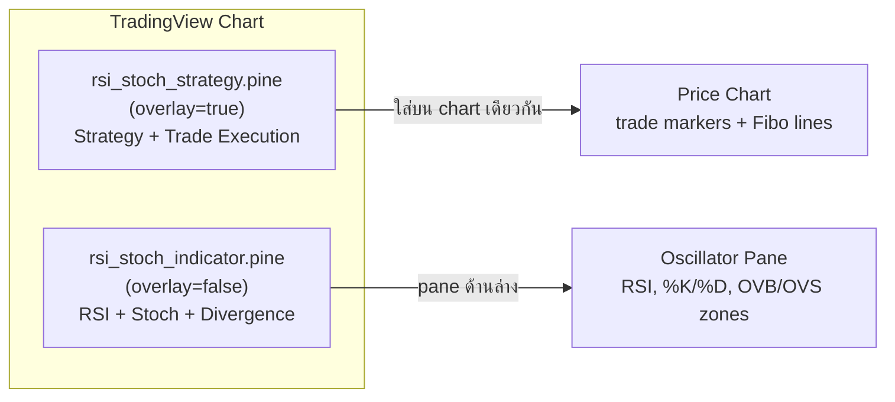

# RSI+Stoch Fibo Strategy — Logic Reference

ไฟล์: `pine/rsi_stoch_strategy.pine`

## Overview Flow



## Step-by-Step Detail

### Step 1: State Tracking



**ตัวอย่าง (XAUUSD 1D):**
- Stoch เข้า OVB → ราคา High = 3,450 → Stoch ออก OVB → `lastCompletedOvbHigh = 3,450`
- Stoch เข้า OVS → ราคา Low = 3,280 → Stoch ออก OVS → `lastCompletedOvsLow = 3,280`

### Step 2: Base Zone (กรอบปรับฐาน)



| Event | ผลลัพธ์ |
|---|---|
| Stoch ออก OVS | Resistance = High ของ OVB cycle ที่ผ่านมา |
| Stoch ออก OVB | Support = Low ของ OVS cycle ที่ผ่านมา |
| RSI เข้า OVB/OVS | **Reset ทั้งหมด** (ตัดภูเขา) |

### Step 3: Trend Recognition



**PERFECT vs V-SHAPE:**
- **PERFECT**: Stoch swing ก่อนหน้ามี Higher Low (ขาขึ้น) → โครงสร้างแข็ง → invalidation ยากกว่า
- **V-SHAPE**: ไม่มี structural confirmation → invalidation ง่ายกว่า (กลับตัว 30% ก่อนถึง Fibo 1.618 = ยกเลิก)

### Step 4: Fibonacci Targets



**ตัวอย่าง Long:**
```
Support (Head)    = 3,280
Resistance (End)  = 3,450
Range             = 3,450 - 3,280 = 170

Fibo 1.618 (TP1)  = 3,280 + 170 × 1.618 = 3,555
Fibo 2.618 (TP2)  = 3,280 + 170 × 2.618 = 3,725
Fibo 4.236 (MAX)  = 3,280 + 170 × 4.236 = 4,000
```

### Step 5: Entry & Exit



### Trailing Stop (Stoch Swing Structure)



**ตัวอย่าง Trailing Stop (Long):**
```
OVS Cycle 1: Low = 3,280 → SL = 3,280
OVS Cycle 2: Low = 3,320 → SL ขยับขึ้นเป็น 3,320 (Higher Low)
OVS Cycle 3: Low = 3,350 → SL ขยับขึ้นเป็น 3,350
ราคาหลุด 3,350 → ปิด Position
```

### Invalidation Rules



## Files Architecture



## Settings Reference

| Parameter | Default | คำอธิบาย |
|---|---|---|
| RSI Length | 14 | ความยาว RSI |
| %K / %D / Smoothing | 9 / 3 / 3 | Stochastic parameters |
| Stoch OVB/OVS | 80 / 20 | เกณฑ์ Overbought/Oversold |
| RSI OVB/OVS | 70 / 30 | เกณฑ์ RSI reset (ตัดภูเขา) |
| TP1 Fibo Level | 1.618 | Fibo level สำหรับ Take Profit 1 |
| TP2 Fibo Level | 2.618 | Fibo level สำหรับ Take Profit 2 |
| Use TP2 | true | แบ่ง 50/50 ที่ TP1 และ TP2 |
| Trade Direction | Both | Long / Short / Both |
| Initial Capital | 100,000 | ทุนเริ่มต้น backtest |
| Commission | 0.1% | ค่า commission ต่อ trade |

## Known Issues / TODO

- [ ] **Entry: แท่งกลับตัว** — ยังไม่ได้ใส่ logic candlestick reversal pattern (รอ confirm จาก user ว่าต้องการ pattern แบบไหน)
- [ ] **TP ติดลบ** — บางกรณี TP ถูก hit แต่ยังขาดทุน ต้องตรวจสอบว่า Fibo range กว้างพอหรือไม่
- [ ] **MTF Cluster** — ยังไม่ได้ใส่ใน strategy version (มีแค่ใน rsi_stoch_state.pine)
- [ ] **RSI Divergence** — ยังไม่ได้ใส่ใน strategy version (มีแค่ใน rsi_stoch_indicator.pine)
